# Arquitetura: 001-workflow-queue

**Data**: 2025-01-27  
**Versão**: 1.0  
**Status**: ✅ Implementado

---

## 📋 Índice

1. [Visão Geral](#visão-geral)
2. [Por Que Esta Arquitetura?](#por-que-esta-arquitetura)
3. [Componentes Principais](#componentes-principais)
4. [Fluxo Completo](#fluxo-completo)
5. [Fluxo de Pausa/Resume](#fluxo-de-pausaresume)
6. [Estrutura de Módulos](#estrutura-de-módulos)
7. [Como Adicionar Novos Stages](#como-adicionar-novos-stages)
8. [Como Testar](#como-testar)
9. [Manutenção](#manutenção)

---

## 🎯 Visão Geral

A arquitetura separa claramente **Workflow** (orquestração) de **Pipeline** (execução técnica), permitindo:

- ✅ Execução assíncrona não-bloqueante
- ✅ Persistência de estado para recuperação após crashes
- ✅ Pausa/resume de workflows pesados
- ✅ Escalabilidade horizontal
- ✅ Testabilidade isolada

```mermaid
graph TB
    subgraph "Webhook Handler"
        WH[Webhook Recebido]
        WPP[WebhookProcessingJobProcessor]
        WH --> WPP
    end

    subgraph "Workflow Queue"
        WPP -->|Enfileira| QUEUE[RabbitMQ Queue]
        QUEUE -->|Processa| CRP[CodeReviewJobProcessor]
    end

    subgraph "Pipeline Executor"
        CRP -->|Executa| PE[PipelineExecutor]
        PE -->|Orquestra| STAGES[Stages]
    end

    subgraph "Stages"
        STAGES --> LIGHT[Light Stages<br/>Rápidos, Síncronos]
        STAGES --> HEAVY[Heavy Stages<br/>Pesados, Assíncronos]
    end

    subgraph "Event System"
        HEAVY -->|Publica Evento| EVENT[Event Bus]
        EVENT -->|Retoma| HSEH[HeavyStageEventHandler]
        HSEH -->|Reenfileira| QUEUE
    end

    style WH fill:#e1f5ff
    style PE fill:#fff4e1
    style HEAVY fill:#ffe1f5
    style EVENT fill:#e1ffe1
```



---

## 🤔 Por Que Esta Arquitetura?

### Problema Original

- ❌ Code reviews executavam síncronamente no mesmo processo
- ❌ Deploys bloqueavam durante execução
- ❌ Sem persistência de estado (perda de dados em crashes)
- ❌ Stages pesados bloqueavam workers
- ❌ Difícil escalar horizontalmente

### Solução Implementada

- ✅ **Workflow Queue**: Orquestração assíncrona via RabbitMQ
- ✅ **Pipeline Executor**: Orquestrador que garante execução completa
- ✅ **State Persistence**: Estado salvo após cada stage
- ✅ **Heavy Stages**: Pausam workflow e retomam via eventos
- ✅ **Escalabilidade**: Múltiplos workers processam jobs em paralelo

### Decisões Arquiteturais

1. **Separação Workflow/Pipeline**: Workflow gerencia jobs, Pipeline executa stages
2. **Event-Driven Heavy Stages**: Stages pesados não bloqueiam workers
3. **State Persistence**: Permite recuperação após crashes
4. **Compensation**: Rollback automático em caso de falhas

---

## 🏗️ Componentes Principais

### 1. Workflow Queue Layer


**Responsabilidades**:

- `WorkflowJobConsumer`: Consome jobs do RabbitMQ
- `JobProcessorRouter`: Roteia jobs para processadores corretos
- `WebhookProcessingJobProcessor`: Processa webhooks e enfileira CODE_REVIEW
- `CodeReviewJobProcessor`: Processa jobs de code review

### 2. Pipeline Executor Layer


**Responsabilidades**:

- `CodeReviewPipelineExecutor`: Orquestra execução de stages
- `PipelineStateManager`: Gerencia persistência e recuperação de estado

### 3. Stages Layer

```mermaid
graph TB
    subgraph "Stages"
        BASE[BaseStage<br/>Abstração Base]
        BASE --> LIGHT[Light Stages<br/>isLight() = true]
        BASE --> HEAVY[Heavy Stages<br/>isLight() = false]
    end

    LIGHT -->|Exemplos| L1[ValidateNewCommitsStage]
    LIGHT -->|Exemplos| L2[ResolveConfigStage]
    LIGHT -->|Exemplos| L3[CreateFileCommentsStage]

    HEAVY -->|Exemplos| H1[ProcessFilesPrLevelReviewStage]
    HEAVY -->|Exemplos| H2[ProcessFilesReview]
    HEAVY -->|Exemplos| H3[CodeAnalysisASTStage]

    style BASE fill:#fff4e1
    style LIGHT fill:#e1ffe1
    style HEAVY fill:#ffe1f5
```

**Características**:

- **Light Stages**: Executam rapidamente, síncronos
- **Heavy Stages**: Podem pausar workflow, assíncronos

---

## 🔄 Fluxo Completo

### Fluxo End-to-End

```mermaid
sequenceDiagram
    participant WH as Webhook Handler
    participant WPP as WebhookProcessingJobProcessor
    participant RMQ as RabbitMQ
    participant CRP as CodeReviewJobProcessor
    participant PE as PipelineExecutor
    participant STAGE as Stage
    participant DB as PostgreSQL

    WH->>WPP: Webhook recebido
    WPP->>WPP: Identifica plataforma
    WPP->>WPP: Chama handler específico
    WPP->>WPP: Handler salva PR
    WPP->>RMQ: Enfileira CODE_REVIEW job
    RMQ->>CRP: Job disponível
    CRP->>CRP: Cria AutomationExecution
    CRP->>CRP: Inicializa contexto
    CRP->>PE: execute(context, stages, jobId)
    PE->>DB: Salva estado inicial
    PE->>STAGE: Executa stage 1 (light)
    STAGE-->>PE: Contexto atualizado
    PE->>DB: Salva estado após stage 1
    PE->>STAGE: Executa stage 2 (heavy)
    STAGE->>STAGE: start() - inicia trabalho
    STAGE-->>PE: Lança WorkflowPausedError
    PE->>CRP: Erro propagado
    CRP->>DB: Atualiza job para WAITING_FOR_EVENT
    CRP->>RMQ: Worker liberado

    Note over RMQ: Worker pode processar outros jobs

    STAGE->>RMQ: Publica evento de conclusão
    RMQ->>HSEH: HeavyStageEventHandler recebe evento
    HSEH->>DB: Busca jobs WAITING_FOR_EVENT
    HSEH->>RMQ: Publica workflow.jobs.resumed
    RMQ->>CRP: Job retomado
    CRP->>PE: resume(context, stages, taskId)
    PE->>STAGE: getResult() - busca resultado
    PE->>STAGE: resume() - continua execução
    PE->>STAGE: Executa stages restantes
    PE->>DB: Salva estado final
    PE-->>CRP: Pipeline completo
    CRP->>DB: Atualiza job para COMPLETED
```



---

## ⏸️ Fluxo de Pausa/Resume

### Detalhamento do Fluxo de Pausa

```mermaid
sequenceDiagram
    participant PE as PipelineExecutor
    participant HS as HeavyStage
    participant DB as Database
    participant RMQ as RabbitMQ
    participant HSEH as HeavyStageEventHandler

    PE->>HS: execute(context)
    HS->>HS: start() - inicia trabalho assíncrono
    HS->>HS: Retorna taskId
    HS-->>PE: Lança WorkflowPausedError(taskId, eventType)
    PE->>DB: Salva estado (pipelineState)
    PE-->>CRP: Propaga erro
    CRP->>DB: Atualiza job: WAITING_FOR_EVENT
    CRP->>DB: Salva waitingForEvent: {eventType, eventKey}
    Note over CRP: Worker liberado para outros jobs

    Note over HS: Trabalho pesado executando...

    HS->>RMQ: Publica evento: stage.completed.*
    RMQ->>HSEH: Evento recebido
    HSEH->>DB: Busca jobs WAITING_FOR_EVENT
    HSEH->>DB: Filtra por eventType + eventKey
    HSEH->>DB: Atualiza job: PENDING
    HSEH->>DB: Salva stageCompletedEvent no metadata
    HSEH->>RMQ: Publica workflow.jobs.resumed
    RMQ->>CRP: Job retomado
    CRP->>CRP: Detecta resume (tem pipelineState)
    CRP->>PE: resume(context, stages, taskId)
    PE->>DB: Carrega estado salvo
    PE->>HS: getResult(context, taskId)
    HS-->>PE: Retorna resultado
    PE->>HS: resume(context, taskId)
    HS-->>PE: Contexto atualizado
    PE->>PE: Continua execução dos stages restantes
```



### Diagrama de Estados do Job

```mermaid
stateDiagram-v2
    [*] --> PENDING: Job criado
    PENDING --> PROCESSING: Worker pega job
    PROCESSING --> WAITING_FOR_EVENT: Heavy stage pausa
    WAITING_FOR_EVENT --> PENDING: Evento chega
    PENDING --> PROCESSING: Worker retoma
    PROCESSING --> COMPLETED: Pipeline completo
    PROCESSING --> FAILED: Erro não retryable
    PROCESSING --> RETRYING: Erro retryable
    RETRYING --> PENDING: Retry agendado
    FAILED --> [*]
    COMPLETED --> [*]
```



---

## 📦 Estrutura de Módulos

### Dependências entre Módulos


### Injeção de Dependências


---

## ➕ Como Adicionar Novos Stages

### 1. Criar Light Stage

```typescript
import { Injectable } from '@nestjs/common';
import { BaseStage } from '../base/base-stage.abstract';
import { CodeReviewPipelineContext } from '../context/code-review-pipeline.context';

@Injectable()
export class MyNewLightStage extends BaseStage {
    name = 'MyNewLightStage';
    dependsOn: string[] = ['PreviousStage']; // Opcional

    async execute(
        context: CodeReviewPipelineContext,
    ): Promise<CodeReviewPipelineContext> {
        // Sua lógica aqui
        return this.updateContext(context, (draft) => {
            draft.myNewData = 'value';
        });
    }

    // isLight() já retorna true por padrão em BaseStage
}
```

### 2. Criar Heavy Stage

```typescript
import { Injectable } from '@nestjs/common';
import { BaseStage } from '../base/base-stage.abstract';
import { HeavyStage } from '../base/heavy-stage.interface';
import { CodeReviewPipelineContext } from '../context/code-review-pipeline.context';
import { EventType } from '@/core/domain/workflowQueue/enums/event-type.enum';
import { WorkflowPausedError } from '@/core/domain/workflowQueue/errors/workflow-paused.error';
import { v4 as uuidv4 } from 'uuid';

@Injectable()
export class MyNewHeavyStage extends BaseStage implements HeavyStage {
    name = 'MyNewHeavyStage';
    dependsOn: string[] = ['PreviousStage'];
    timeout = 10 * 60 * 1000; // 10 minutos
    eventType = EventType.MY_NEW_STAGE_COMPLETED; // Adicionar ao enum

    isLight(): boolean {
        return false;
    }

    async start(context: CodeReviewPipelineContext): Promise<string> {
        const taskId = uuidv4();
        // Inicia trabalho assíncrono (ex: enfileira job, chama API externa)
        // ...
        return taskId;
    }

    async getResult(
        context: CodeReviewPipelineContext,
        taskId: string,
    ): Promise<CodeReviewPipelineContext> {
        // Busca resultado do trabalho assíncrono
        // ...
        return this.updateContext(context, (draft) => {
            draft.myResult = result;
        });
    }

    async resume(
        context: CodeReviewPipelineContext,
        taskId: string,
    ): Promise<CodeReviewPipelineContext> {
        // Processa resultado e continua
        // ...
        return context;
    }

    async execute(
        context: CodeReviewPipelineContext,
    ): Promise<CodeReviewPipelineContext> {
        const taskId = await this.start(context);
        // Lança erro para pausar workflow
        throw new WorkflowPausedError(
            this.eventType,
            taskId,
            this.name,
            taskId,
            this.timeout,
            { workflowJobId: context.workflowJobId },
        );
    }
}
```

### 3. Registrar Stage no Módulo

```typescript
// libs/code-review/pipeline/code-review-pipeline.module.ts
@Module({
    providers: [
        // ... outros stages
        MyNewLightStage,
        MyNewHeavyStage,
    ],
    exports: [
        // ... outros stages
        MyNewLightStage,
        MyNewHeavyStage,
    ],
})
export class CodeReviewPipelineModule {}
```

### 4. Adicionar ao Strategy

```typescript
// libs/code-review/pipeline/ee/strategies/code-review-pipeline.strategy.ee.ts
configureStages(): Stage[] {
    return [
        // ... outros stages
        this.myNewLightStage,
        this.myNewHeavyStage,
    ];
}
```

### 5. Publicar Evento de Conclusão

Quando o trabalho pesado completar, publique o evento:

```typescript
await this.amqpConnection.publish(
    'workflow.events',
    'stage.completed.my.new.stage',
    {
        stageName: 'MyNewHeavyStage',
        eventType: EventType.MY_NEW_STAGE_COMPLETED,
        eventKey: taskId,
        taskId: taskId,
        result: {
            /* resultado */
        },
        workflowJobId: context.workflowJobId,
        correlationId: context.correlationId,
    },
);
```

---

## 🧪 Como Testar

### 1. Testes Unitários

#### Testar Light Stage

```typescript
describe('MyNewLightStage', () => {
    let stage: MyNewLightStage;
    let mockDependency: MockDependency;

    beforeEach(() => {
        mockDependency = createMockDependency();
        stage = new MyNewLightStage(mockDependency);
    });

    it('should execute successfully', async () => {
        const context = createMockContext();
        const result = await stage.execute(context);

        expect(result.myNewData).toBe('value');
        expect(mockDependency.method).toHaveBeenCalled();
    });

    it('should respect dependencies', () => {
        expect(stage.dependsOn).toContain('PreviousStage');
    });
});
```

#### Testar Heavy Stage

```typescript
describe('MyNewHeavyStage', () => {
    let stage: MyNewHeavyStage;

    it('should start and return taskId', async () => {
        const context = createMockContext();
        const taskId = await stage.start(context);

        expect(taskId).toBeDefined();
        expect(mockService.startWork).toHaveBeenCalled();
    });

    it('should pause workflow when executing', async () => {
        const context = createMockContext();

        await expect(stage.execute(context)).rejects.toThrow(
            WorkflowPausedError,
        );
    });

    it('should get result correctly', async () => {
        const context = createMockContext();
        const taskId = 'test-task-id';

        mockService.getResult.mockResolvedValue({ data: 'result' });
        const result = await stage.getResult(context, taskId);

        expect(result.myResult).toBeDefined();
    });
});
```

### 2. Testes de Integração

#### Testar Fluxo Completo

```typescript
describe('CodeReviewPipeline Integration', () => {
    it('should execute complete pipeline', async () => {
        // 1. Criar job
        const job = await createWorkflowJob({
            workflowType: WorkflowType.CODE_REVIEW,
            payload: mockPayload,
        });

        // 2. Processar job
        await codeReviewJobProcessor.process(job.id);

        // 3. Verificar estado
        const updatedJob = await workflowJobRepository.findOne(job.id);
        expect(updatedJob.status).toBe(JobStatus.COMPLETED);
        expect(updatedJob.pipelineState).toBeDefined();
    });

    it('should pause and resume workflow', async () => {
        // 1. Criar job
        const job = await createWorkflowJob({...});

        // 2. Processar até heavy stage
        await codeReviewJobProcessor.process(job.id);

        // 3. Verificar pausa
        const pausedJob = await workflowJobRepository.findOne(job.id);
        expect(pausedJob.status).toBe(JobStatus.WAITING_FOR_EVENT);

        // 4. Publicar evento de conclusão
        await publishStageCompletedEvent({
            stageName: 'ProcessFilesReview',
            eventType: EventType.FILES_REVIEW_COMPLETED,
            taskId: 'test-task-id',
        });

        // 5. Aguardar retomada
        await waitForJobResume(job.id);

        // 6. Verificar conclusão
        const completedJob = await workflowJobRepository.findOne(job.id);
        expect(completedJob.status).toBe(JobStatus.COMPLETED);
    });
});
```

### 3. Testes E2E

```typescript
describe('CodeReview E2E', () => {
    it('should process webhook to completion', async () => {
        // 1. Receber webhook
        const webhookResponse = await request(app)
            .post('/webhooks/github')
            .send(mockGitHubWebhook);

        // 2. Aguardar processamento
        await waitForJobCompletion(webhookResponse.body.jobId);

        // 3. Verificar resultado
        const job = await getWorkflowJob(webhookResponse.body.jobId);
        expect(job.status).toBe(JobStatus.COMPLETED);

        // 4. Verificar comentários criados
        const comments = await getPRComments(prNumber);
        expect(comments.length).toBeGreaterThan(0);
    });
});
```

---

## 🔧 Manutenção

### Debugging

#### Verificar Estado de um Job

```typescript
const job = await workflowJobRepository.findOne(jobId);
console.log('Status:', job.status);
console.log('Pipeline State:', JSON.stringify(job.pipelineState, null, 2));
console.log('Current Stage:', job.pipelineState?.currentStage);
console.log('Waiting For:', job.waitingForEvent);
```

#### Verificar Jobs Pausados

```sql
SELECT id, status, "waitingForEvent", metadata
FROM workflow.workflow_jobs
WHERE status = 'WAITING_FOR_EVENT';
```

#### Verificar Eventos Publicados

```typescript
// Verificar eventos no RabbitMQ
// Exchange: workflow.events
// Routing Key: stage.completed.*
```

### Troubleshooting Comum

#### Job Ficou Pausado e Não Retomou

1. Verificar se evento foi publicado:

    ```typescript
    // Verificar logs do stage que deveria publicar evento
    ```

2. Verificar se `HeavyStageEventHandler` está escutando:

    ```typescript
    // Verificar logs do HeavyStageEventHandler
    ```

3. Verificar matching de eventos:
    ```typescript
    // eventType e eventKey devem corresponder exatamente
    ```

#### Estado Perdido Após Crash

1. Verificar se `pipelineState` foi salvo:

    ```sql
    SELECT "pipelineState" FROM workflow.workflow_jobs WHERE id = 'job-id';
    ```

2. Verificar se `PipelineStateManager` está funcionando:
    ```typescript
    // Verificar logs de saveState
    ```

#### Stage Não Executa na Ordem Correta

1. Verificar `dependsOn`:

    ```typescript
    // Stage deve ter dependsOn correto
    ```

2. Verificar ordem no strategy:
    ```typescript
    // Stages devem estar na ordem correta no configureStages()
    ```

### Métricas e Monitoramento

#### Métricas Importantes

- **Queue Size**: Tamanho da fila de jobs
- **Processing Time**: Tempo médio de processamento
- **Pause/Resume Rate**: Taxa de pausas e retomadas
- **Error Rate**: Taxa de erros
- **Stage Duration**: Tempo de execução por stage

#### Health Checks

```typescript
// Verificar saúde do sistema
GET /health/workflow-queue
{
    "queueSize": 10,
    "activeJobs": 5,
    "pausedJobs": 2,
    "workers": 3
}
```

---

## 📚 Referências

- [Especificação da Feature](./specs/001-workflow-queue/spec.md)
- [Plano de Implementação](./specs/001-workflow-queue/plan.md)
- [Revisão da Implementação](./REVISAO-IMPLEMENTACAO-001-WORKFLOW-QUEUE.md)
- [Análise do Provider](./ANALISE-CODE-REVIEW-PIPELINE-PROVIDER.md)

---

## 🎓 Glossário

- **Workflow**: Orquestração de alto nível (gerencia jobs)
- **Pipeline**: Execução técnica (executa stages)
- **Light Stage**: Stage rápido, executa síncronamente
- **Heavy Stage**: Stage pesado, pode pausar workflow
- **WorkflowPausedError**: Erro especial que pausa workflow (não é falha)
- **PipelineState**: Estado serializado do pipeline salvo no banco (**Durable Execution**)
- **Durable Execution**: Padrão onde estado é persistido para retomar após falhas/crashes
- **Event-Driven**: Arquitetura baseada em eventos assíncronos
- **Checkpoint**: Ponto de salvamento do estado (após cada stage)
