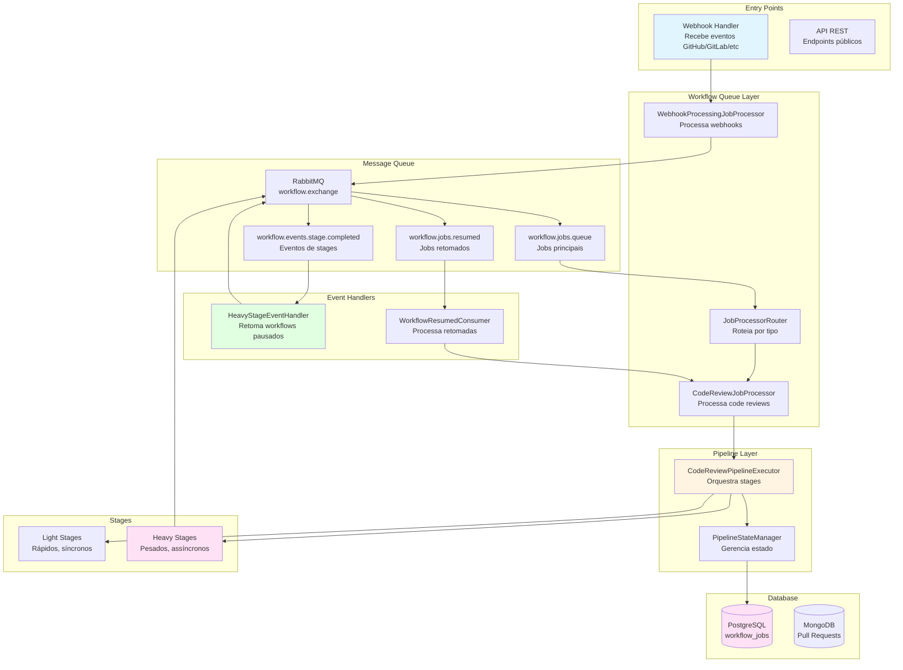
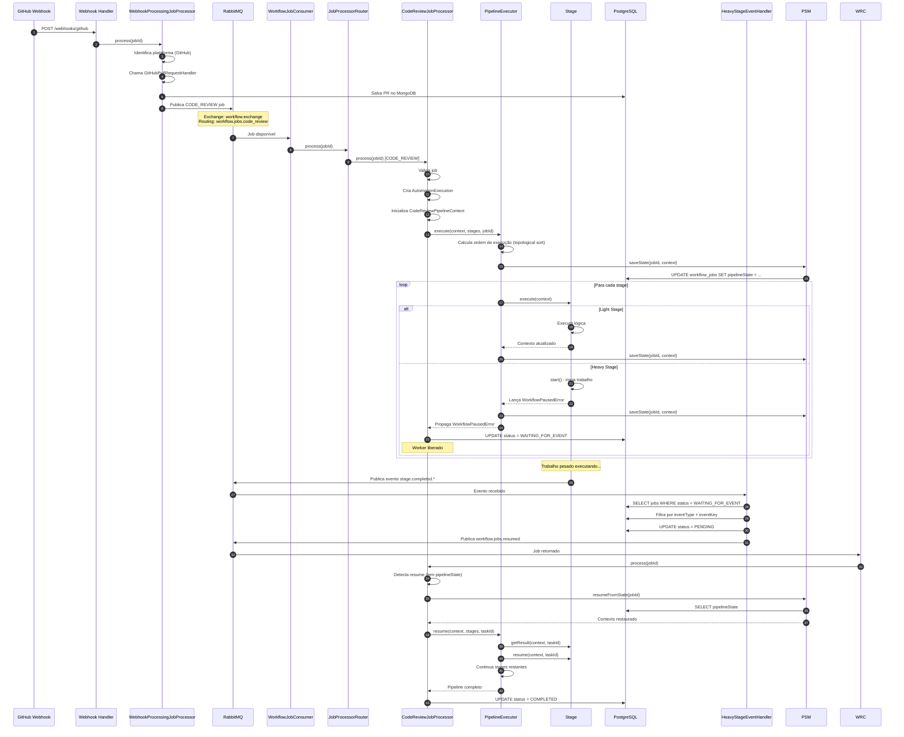
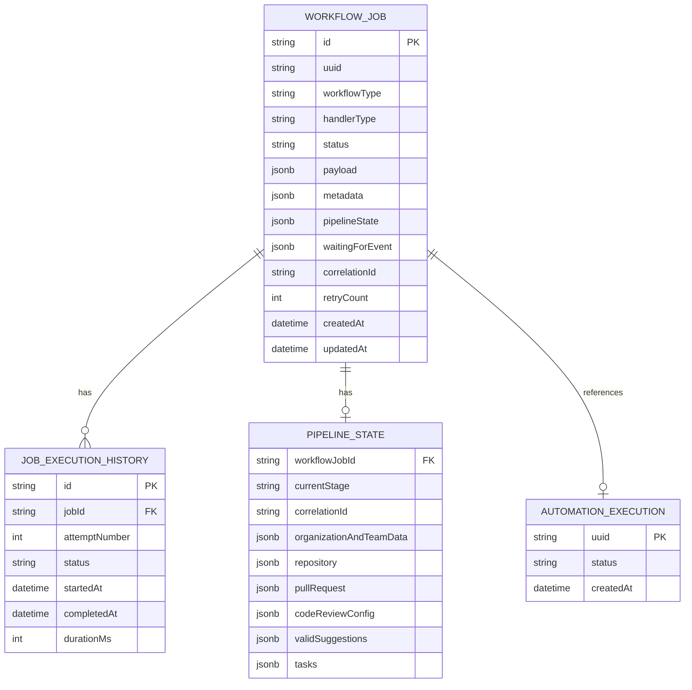
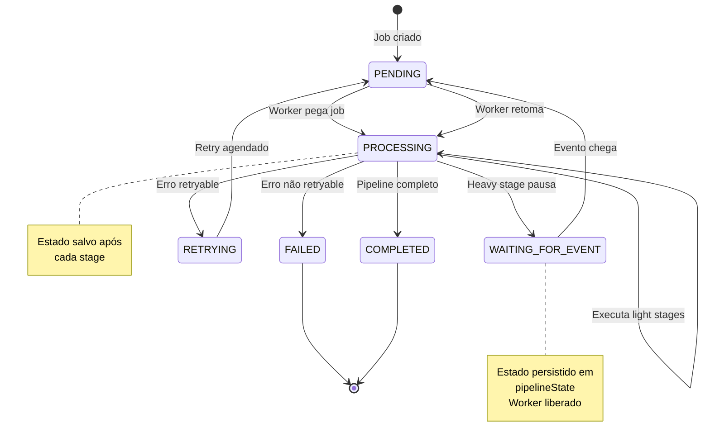
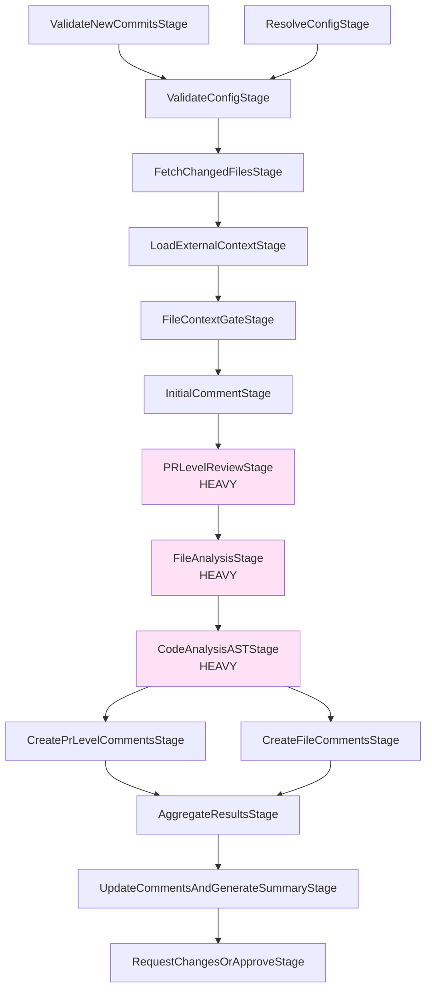
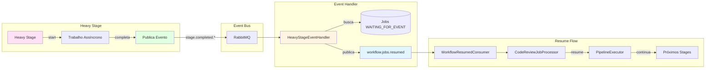
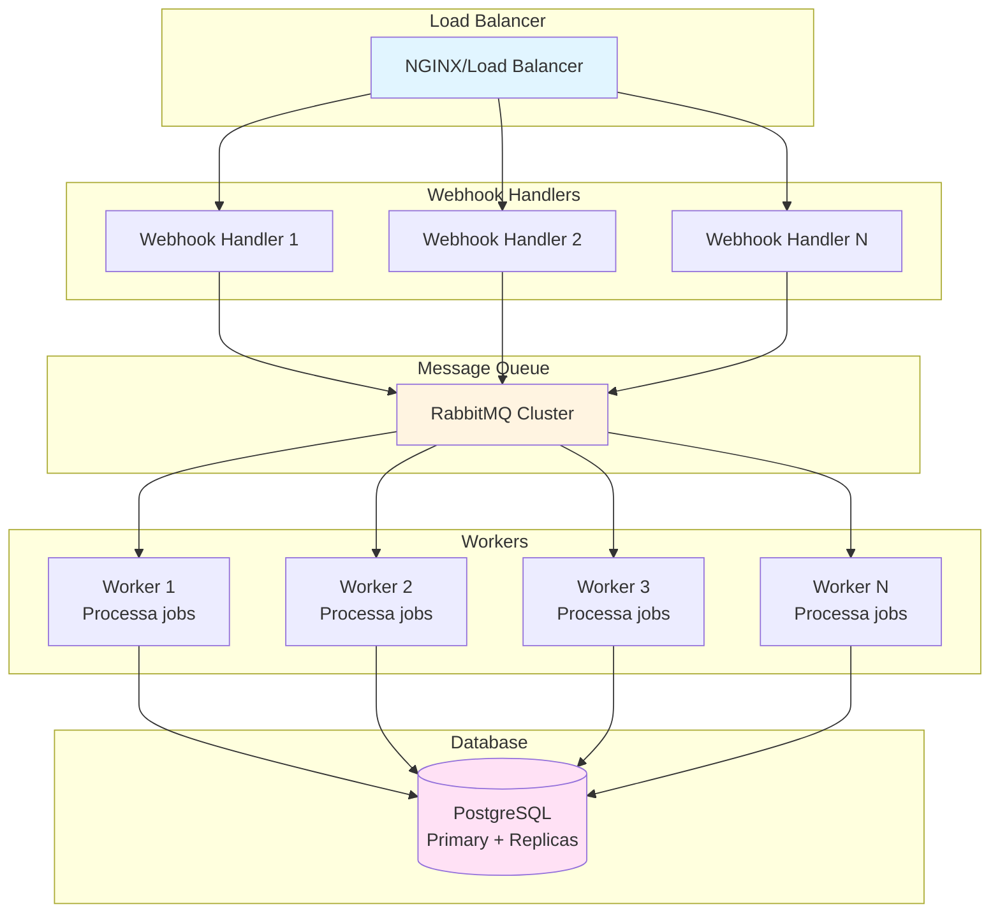
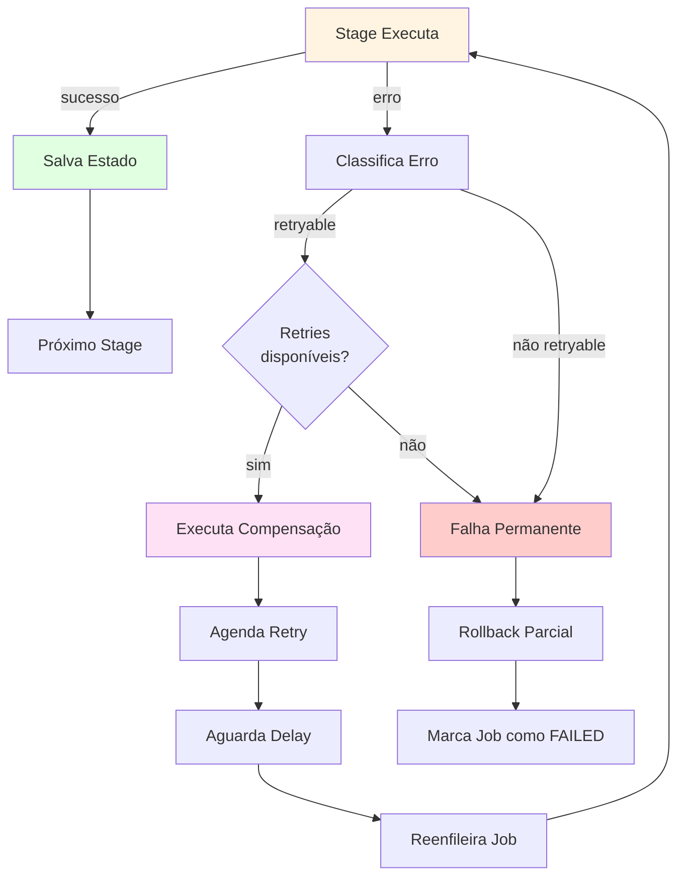
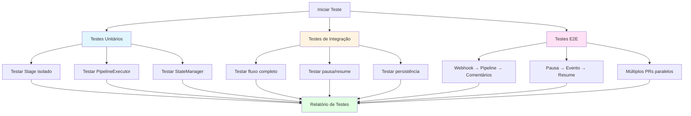

# Diagramas de Arquitetura: 001-workflow-queue

**Data**: 2025-01-27  
**Versão**: 1.0

---

## 📊 Diagrama 1: Arquitetura Geral

---

## 📊 Diagrama 2: Fluxo Sequencial Detalhado

---

## 📊 Diagrama 3: Estrutura de Dados

---

## 📊 Diagrama 4: Ciclo de Vida de um Job

---

## 📊 Diagrama 5: Dependências entre Stages

---

## 📊 Diagrama 6: Fluxo de Eventos

---

## 📊 Diagrama 7: Escalabilidade

---

## 📊 Diagrama 8: Tratamento de Erros

---

## 📊 Diagrama 9: Comparação: Antes vs Depois

```mermaid
graph TB
    subgraph "ANTES: Síncrono"
        A1[Webhook] --> A2[RunCodeReviewAutomationUseCase]
        A2 --> A3[PipelineExecutor]
        A3 --> A4[Stages Sequenciais]
        A4 --> A5[Bloqueia Worker]
        A5 --> A6[Sem Persistência]
        A6 --> A7[Sem Pausa/Resume]
    end

    subgraph "DEPOIS: Assíncrono"
        D1[Webhook] --> D2[WebhookProcessingJobProcessor]
        D2 --> D3[RabbitMQ Queue]
        D3 --> D4[CodeReviewJobProcessor]
        D4 --> D5[PipelineExecutor]
        D5 --> D6[Stages com Persistência]
        D6 --> D7[Heavy Stages Pausam]
        D7 --> D8[Worker Liberado]
        D8 --> D9[Retoma via Eventos]
    end

    style A5 fill:#ffcccc
    style A6 fill:#ffcccc
    style A7 fill:#ffcccc
    style D7 fill:#e1ffe1
    style D8 fill:#e1ffe1
    style D9 fill:#e1ffe1
```

---

## 📊 Diagrama 10: Fluxo de Testes

