# Diagramas de Arquitetura: 001-workflow-queue

**Data**: 2025-01-27  
**Versão**: 1.0

---

## 📊 Diagrama 1: Arquitetura Geral

---

## 📊 Diagrama 2: Fluxo Sequencial Detalhado

---

## 📊 Diagrama 3: Estrutura de Dados

---

## 📊 Diagrama 4: Ciclo de Vida de um Job

```mermaid
stateDiagram-v2
    [*] --> PENDING: Job criado

    PENDING --> PROCESSING: Worker pega job
    PROCESSING --> PROCESSING: Executa light stages
    PROCESSING --> WAITING_FOR_EVENT: Heavy stage pausa
    PROCESSING --> COMPLETED: Pipeline completo
    PROCESSING --> FAILED: Erro não retryable
    PROCESSING --> RETRYING: Erro retryable

    WAITING_FOR_EVENT --> PENDING: Evento chega
    PENDING --> PROCESSING: Worker retoma

    RETRYING --> PENDING: Retry agendado

    FAILED --> [*]
    COMPLETED --> [*]

    note right of WAITING_FOR_EVENT
        Estado persistido em
        pipelineState
        Worker liberado
    end note

    note right of PROCESSING
        Estado salvo após
        cada stage
    end note
```

---

## 📊 Diagrama 5: Dependências entre Stages

---

## 📊 Diagrama 6: Fluxo de Eventos

```mermaid
graph LR
    subgraph "Heavy Stage"
        HS[Heavy Stage]
        HS -->|start| TASK[Trabalho Assíncrono]
        TASK -->|completa| EVENT[Publica Evento]
    end

    subgraph "Event Bus"
        EVENT -->|stage.completed.*| RMQ[RabbitMQ]
    end

    subgraph "Event Handler"
        RMQ --> HSEH[HeavyStageEventHandler]
        HSEH -->|busca| DB[(Jobs WAITING_FOR_EVENT)]
        HSEH -->|publica| RESUME[workflow.jobs.resumed]
    end

    subgraph "Resume Flow"
        RESUME --> WRC[WorkflowResumedConsumer]
        WRC --> CRP[CodeReviewJobProcessor]
        CRP -->|resume| PE[PipelineExecutor]
        PE -->|continua| NEXT[Próximos Stages]
    end

    style HS fill:#ffe1f5
    style EVENT fill:#e1ffe1
    style HSEH fill:#fff4e1
    style RESUME fill:#e1f5ff
```

---

## 📊 Diagrama 7: Escalabilidade

---

## 📊 Diagrama 8: Tratamento de Erros

```mermaid
graph TD
    START[Stage Executa]
    START -->|sucesso| SAVE[Salva Estado]
    START -->|erro| CLASSIFY[Classifica Erro]

    CLASSIFY -->|retryable| RETRY{Retries<br/>disponíveis?}
    CLASSIFY -->|não retryable| FAIL[Falha Permanente]

    RETRY -->|sim| COMPENSATE[Executa Compensação]
    RETRY -->|não| FAIL

    COMPENSATE --> SCHEDULE[Agenda Retry]
    SCHEDULE --> WAIT[Aguarda Delay]
    WAIT --> RETRY_JOB[Reenfileira Job]

    FAIL --> ROLLBACK[Rollback Parcial]
    ROLLBACK --> MARK_FAILED[Marca Job como FAILED]

    SAVE --> NEXT[Próximo Stage]
    RETRY_JOB --> START

    style START fill:#fff4e1
    style FAIL fill:#ffcccc
    style COMPENSATE fill:#ffe1f5
    style SAVE fill:#e1ffe1
```

---

## 📊 Diagrama 9: Comparação: Antes vs Depois

```mermaid
graph TB
    subgraph "ANTES: Síncrono"
        A1[Webhook] --> A2[RunCodeReviewAutomationUseCase]
        A2 --> A3[PipelineExecutor]
        A3 --> A4[Stages Sequenciais]
        A4 --> A5[Bloqueia Worker]
        A5 --> A6[Sem Persistência]
        A6 --> A7[Sem Pausa/Resume]
    end

    subgraph "DEPOIS: Assíncrono"
        D1[Webhook] --> D2[WebhookProcessingJobProcessor]
        D2 --> D3[RabbitMQ Queue]
        D3 --> D4[CodeReviewJobProcessor]
        D4 --> D5[PipelineExecutor]
        D5 --> D6[Stages com Persistência]
        D6 --> D7[Heavy Stages Pausam]
        D7 --> D8[Worker Liberado]
        D8 --> D9[Retoma via Eventos]
    end

    style A5 fill:#ffcccc
    style A6 fill:#ffcccc
    style A7 fill:#ffcccc
    style D7 fill:#e1ffe1
    style D8 fill:#e1ffe1
    style D9 fill:#e1ffe1
```

---

## 📊 Diagrama 10: Fluxo de Testes

```mermaid
graph TD
    START[Iniciar Teste]
    START --> UNIT[Testes Unitários]
    START --> INT[Testes de Integração]
    START --> E2E[Testes E2E]

    UNIT --> U1[Testar Stage isolado]
    UNIT --> U2[Testar PipelineExecutor]
    UNIT --> U3[Testar StateManager]

    INT --> I1[Testar fluxo completo]
    INT --> I2[Testar pausa/resume]
    INT --> I3[Testar persistência]

    E2E --> E1[Webhook → Pipeline → Comentários]
    E2E --> E2[Pausa → Evento → Resume]
    E2E --> E3[Múltiplos PRs paralelos]

    U1 --> REPORT[Relatório de Testes]
    U2 --> REPORT
    U3 --> REPORT
    I1 --> REPORT
    I2 --> REPORT
    I3 --> REPORT
    E1 --> REPORT
    E2 --> REPORT
    E3 --> REPORT

    style UNIT fill:#e1f5ff
    style INT fill:#fff4e1
    style E2E fill:#ffe1f5
    style REPORT fill:#e1ffe1
```

