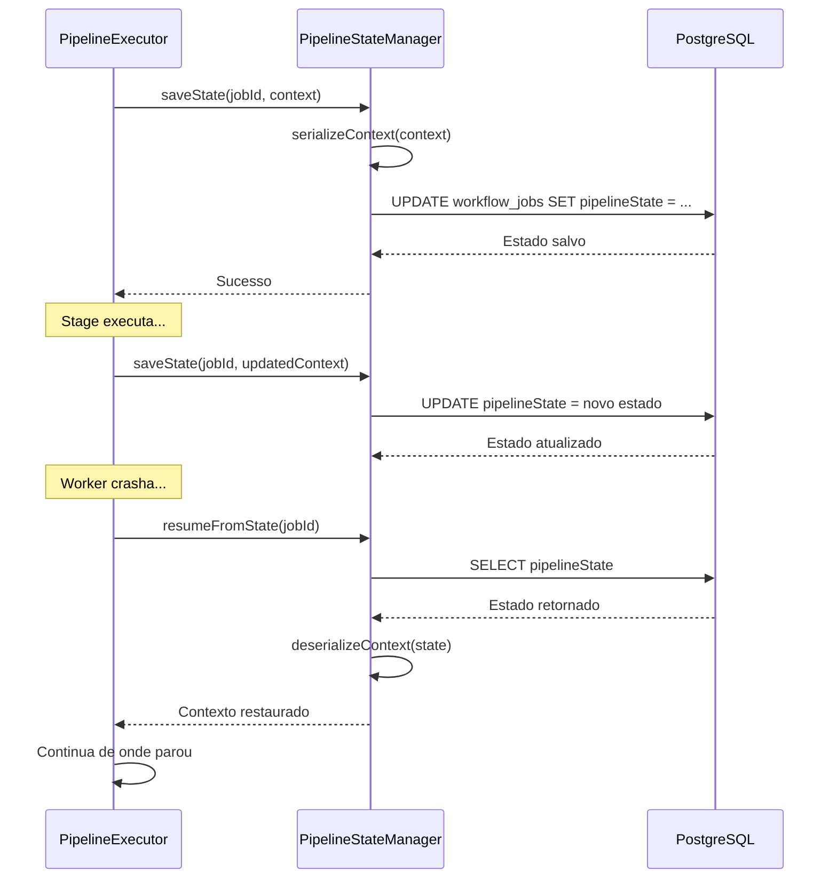

# Durable Execution: Explicação Técnica

**Data**: 2025-01-27  
**Conceito**: Durable Execution (Execução Durável)

---

## 🎯 O Que É Durable Execution?

**Durable Execution** (Execução Durável) é um padrão arquitetural onde o estado de uma execução longa é persistido em um armazenamento durável (banco de dados), permitindo que a execução seja:

- ✅ **Retomada após crashes**: Se o worker crashar, pode retomar do ponto onde parou
- ✅ **Pausada e retomada**: Pode pausar para esperar eventos externos e retomar depois
- ✅ **Escalável**: Múltiplos workers podem retomar execuções diferentes
- ✅ **Resiliente**: Falhas não resultam em perda de progresso

---

## 🔍 Como Implementamos Durable Execution

### 1. Persistência do Estado (`PipelineState`)

```typescript
// Estado é salvo após cada stage
await this.stateManager.saveState(workflowJobId, context);

// Estado é armazenado em PostgreSQL como JSONB
// workflow_jobs.pipelineState: JSONB
```

**O que é persistido**:

- Contexto completo do pipeline (`CodeReviewPipelineContext`)
- Stage atual sendo executado (`currentStage`)
- Dados intermediários (sugestões, arquivos, configurações)
- Metadados (correlationId, workflowJobId)

### 2. Recuperação do Estado

```typescript
// Quando workflow retoma, carrega estado salvo
const context = await this.stateManager.resumeFromState(workflowJobId);

// Pipeline continua de onde parou
await pipelineExecutor.resume(context, stages, taskId);
```

---

## 📊 Comparação com Padrões Conhecidos

### Temporal Workflows (Uber)

```typescript
// Temporal
const workflow = async (input) => {
    const result1 = await activity1(input);
    const result2 = await activity2(result1); // Estado persistido automaticamente
    return result2;
};

// Nossa Implementação
const pipeline = async (context) => {
    const result1 = await stage1.execute(context);
    await stateManager.saveState(jobId, result1); // Estado persistido manualmente
    const result2 = await stage2.execute(result1);
    await stateManager.saveState(jobId, result2);
    return result2;
};
```

**Diferença**: Temporal persiste automaticamente, nós persistimos explicitamente após cada stage.

### AWS Step Functions

```json
{
    "Comment": "Code Review Pipeline",
    "StartAt": "ValidateCommits",
    "States": {
        "ValidateCommits": {
            "Type": "Task",
            "Resource": "arn:aws:lambda:...",
            "Next": "ProcessFiles"
        },
        "ProcessFiles": {
            "Type": "Task",
            "Resource": "arn:aws:lambda:...",
            "Next": "CreateComments"
        }
    }
}
```

**Similaridade**: Ambos persistem estado entre etapas e permitem retomar após falhas.

---

## 🏗️ Nossa Implementação Detalhada

### Estrutura de Dados

```typescript
// workflow_jobs.pipelineState (JSONB)
{
    "workflowJobId": "job-123",
    "currentStage": "ProcessFilesReview",
    "correlationId": "corr-456",
    "organizationAndTeamData": { ... },
    "repository": { ... },
    "pullRequest": { ... },
    "codeReviewConfig": { ... },
    "validSuggestions": [ ... ],
    "tasks": {
        "astAnalysis": {
            "taskId": "ast-task-789",
            "status": "TASK_STATUS_COMPLETED"
        }
    },
    // ... todo o contexto necessário para retomar
}
```

### Fluxo de Persistência



---

## ✅ Benefícios da Durable Execution

### 1. Resilência a Falhas

**Sem Durable Execution**:

```
Worker crasha → Todo progresso perdido → Precisa recomeçar do zero
```

**Com Durable Execution**:

```
Worker crasha → Estado salvo → Novo worker retoma → Continua de onde parou
```

### 2. Pausa/Resume de Longa Duração

**Cenário**: Heavy stage demora 30 minutos

**Sem Durable Execution**:

```
Worker bloqueado por 30 minutos → Não pode processar outros jobs
```

**Com Durable Execution**:

```
Heavy stage pausa → Estado salvo → Worker liberado →
Processa outros jobs → Evento chega → Retoma workflow
```

### 3. Escalabilidade Horizontal

```
Worker 1: Processa job A (pausa no stage X)
Worker 2: Processa job B (pausa no stage Y)
Worker 3: Processa job C (pausa no stage Z)

Worker 1 crasha → Worker 4 retoma job A do stage X
Worker 2 completa → Worker 2 pode pegar job D
```

---

## 🔄 Durable Execution vs Stateless Execution

### Stateless (Sem Estado Persistido)

```typescript
// Execução stateless
async function processJob(jobId: string) {
    const data = await fetchData(jobId);
    const result = await process(data);
    return result;
}

// Se crashar no meio, perde tudo
```

**Características**:

- ❌ Não pode retomar após crash
- ❌ Não pode pausar para eventos externos
- ✅ Mais simples
- ✅ Menos overhead

### Durable (Com Estado Persistido)

```typescript
// Execução durable
async function processJob(jobId: string) {
    let state = (await loadState(jobId)) || initialState;

    state = await step1(state);
    await saveState(jobId, state); // Checkpoint

    state = await step2(state);
    await saveState(jobId, state); // Checkpoint

    return state;
}

// Se crashar, retoma do último checkpoint
```

**Características**:

- ✅ Pode retomar após crash
- ✅ Pode pausar e retomar
- ⚠️ Mais complexo
- ⚠️ Mais overhead (escrita no banco)

---

## 📝 Nossa Abordagem: Durable Execution Híbrida

### Checkpoints Após Cada Stage

```typescript
// PipelineExecutor salva estado após cada stage
for (const stage of stages) {
    context = await stage.execute(context);
    await this.stateManager.saveState(workflowJobId, context); // Checkpoint
}
```

**Vantagens**:

- ✅ Granularidade: Checkpoint após cada etapa
- ✅ Recuperação precisa: Retoma do último stage completo
- ✅ Debugging: Pode inspecionar estado em qualquer ponto

### Estado Completo vs Incremental

**Nossa Abordagem**: Estado Completo

```typescript
// Salvamos o contexto completo após cada stage
pipelineState = {
    ...contextoCompleto, // Tudo que precisa para retomar
    currentStage: 'ProcessFilesReview',
};
```

**Alternativa**: Estado Incremental (mais eficiente, mais complexo)

```typescript
// Salvaria apenas diferenças
pipelineState = {
    checkpoints: [
        { stage: "ValidateCommits", state: {...} },
        { stage: "ProcessFiles", state: {...} }
    ]
}
```

---

## 🎓 Terminologia

### Durable Execution

- **Definição**: Execução que persiste estado para retomar após falhas
- **Sinônimos**: Persistent execution, resumable execution, checkpointing

### PipelineState

- **Definição**: Estado serializado do pipeline salvo no banco
- **Formato**: JSONB no PostgreSQL
- **Conteúdo**: Contexto completo necessário para retomar execução

### Checkpoint

- **Definição**: Ponto de salvamento do estado
- **Em nosso caso**: Após cada stage executado

### Resume

- **Definição**: Retomar execução de um checkpoint
- **Em nosso caso**: Carregar `pipelineState` e continuar do `currentStage`

---

## 🔗 Referências

- **Temporal Workflows**: https://docs.temporal.io/workflows
- **AWS Step Functions**: https://docs.aws.amazon.com/step-functions/
- **Saga Pattern**: Padrão relacionado para transações distribuídas
- **Event Sourcing**: Padrão relacionado para reconstruir estado

---

## ✅ Conclusão

**Sim, `PipelineState` é Durable Execution!**

Implementamos execução durável através de:

1. ✅ Persistência do estado após cada stage (`PipelineState`)
2. ✅ Recuperação do estado para retomar execução (`resumeFromState`)
3. ✅ Suporte a pausa/resume via eventos
4. ✅ Resilência a crashes e falhas

Isso permite que workflows longos sejam executados de forma confiável, mesmo em ambientes distribuídos com múltiplos workers.
