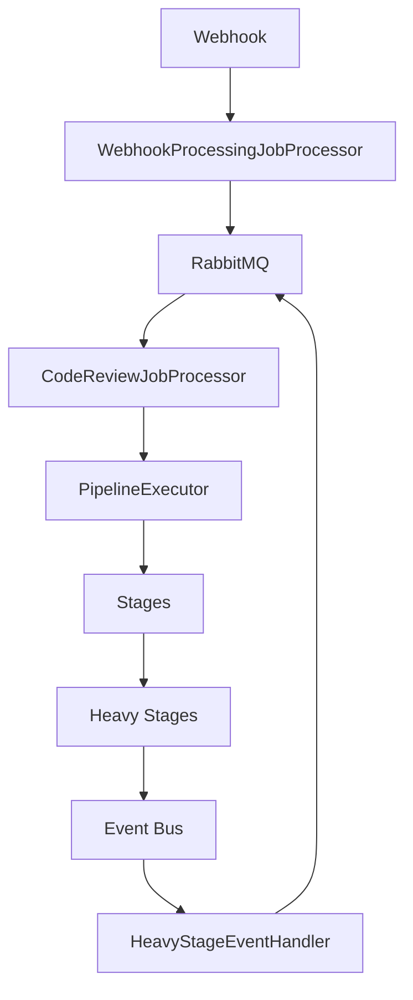
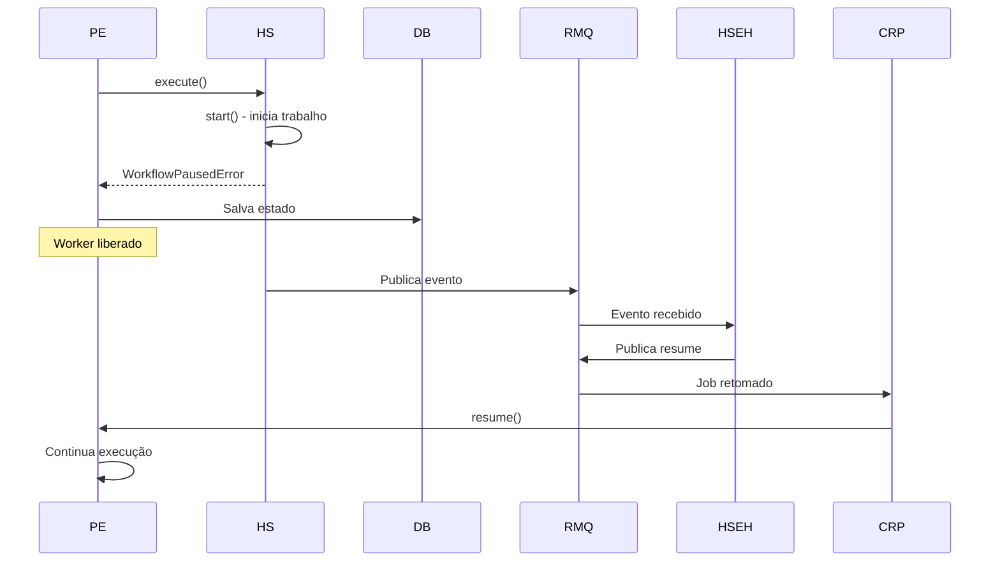

# Documentação: 001-workflow-queue

**Data**: 2025-01-27  
**Status**: ✅ Implementado e Documentado

---

## 📚 Documentação Disponível

### 🎯 Para Entender a Arquitetura

1. **[Arquitetura Completa](./ARQUITETURA-001-WORKFLOW-QUEUE.md)**
    - Visão geral da arquitetura
    - Por que esta arquitetura foi escolhida
    - Componentes principais
    - Fluxos detalhados
    - Como adicionar novos stages
    - Como testar
    - Manutenção

2. **[Diagramas de Arquitetura](./DIAGRAMAS-ARQUITETURA-001.md)**
    - 10 diagramas Mermaid detalhados
    - Arquitetura geral
    - Fluxos sequenciais
    - Estrutura de dados
    - Ciclo de vida
    - Dependências
    - Escalabilidade

### 💻 Para Desenvolvedores

3. **[Guia Prático para Desenvolvedores](./GUIA-PRATICO-DEVELOPERS-001.md)**
    - Quick start (30 segundos)
    - Exemplos práticos de código
    - Como adicionar stages
    - Debugging
    - Troubleshooting comum
    - Referências rápidas

### 📋 Documentação Técnica

4. **[Especificação da Feature](./specs/001-workflow-queue/spec.md)**
    - Requisitos funcionais
    - Requisitos não-funcionais
    - Decisões arquiteturais
    - Critérios de aceitação

5. **[Plano de Implementação](./specs/001-workflow-queue/plan.md)**
    - 9 fases de implementação
    - Dependências entre fases
    - Estimativas de tempo

6. **[Revisão da Implementação](./REVISAO-IMPLEMENTACAO-001-WORKFLOW-QUEUE.md)**
    - Problemas encontrados
    - Correções aplicadas
    - Status final

7. **[Análise do Provider](./ANALISE-CODE-REVIEW-PIPELINE-PROVIDER.md)**
    - Análise do provider legado
    - Correções aplicadas
    - Compatibilidade

8. **[Durable Execution Explicado](./DURABLE-EXECUTION-EXPLAINED.md)**
    - O que é Durable Execution
    - Como implementamos (PipelineState)
    - Comparação com padrões conhecidos (Temporal, AWS Step Functions)
    - Benefícios e trade-offs

9. **[Framework vs Custom: Vale a Pena?](./ANALISE-FRAMEWORK-VS-CUSTOM-DURABLE-EXECUTION.md)**
    - Análise de frameworks disponíveis (Temporal, AWS Step Functions, etc.)
    - Prós e contras de cada abordagem
    - Recomendação para nosso contexto específico
    - Quando considerar migração futura

10. **[Análise Detalhada: DBOS](./ANALISE-DETALHADA-DBOS.md)** ⭐
    - Análise profunda do DBOS (Database Operating System)
    - Casos de uso e histórias de sucesso (incluindo S3Mirror)
    - Boas práticas e precauções
    - Problemas conhecidos e limitações
    - O que analisar antes de implementar
    - Precisamos dele? (Análise específica do nosso caso)
    - Plano de migração completo (se decidirmos usar)
    - Conclusão e recomendações

11. **[Análise de Qualidade: Implementação Atual](./ANALISE-QUALIDADE-IMPLEMENTACAO-ATUAL.md)** ⚠️ **CRÍTICO**
     - Performance: O que está bom e o que pode melhorar
     - Segurança: Gaps críticos identificados ⚠️
     - Observabilidade: Status atual e melhorias sugeridas
     - Manutenabilidade: Avaliação do código atual
     - Testabilidade: Cobertura e melhorias necessárias
     - Resiliência: Retry, circuit breaker, graceful shutdown ⚠️
     - Idempotência: Deduplicação e exactly-once processing
     - Recomendações prioritárias e plano de melhorias

12. **[Análise: Código Existente vs Melhorias](./ANALISE-CODIGO-EXISTENTE-MELHORIAS.md)**
     - O que já temos e pode reusar (observability, retry backoff, cache)
     - O que precisa ser criado (distributed lock, otimizações)
     - Análise detalhada de cada componente
     - Exemplos práticos de implementação

13. **[Plano de Implementação: Melhorias](./PLANO-IMPLEMENTACAO-MELHORIAS.md)** 🚀
     - Fase 1: Retry Policy Avançada (2-3h)
     - Fase 2: Distributed Lock (3-4h)
     - Fase 3: Cache de Configurações (2-3h)
     - Fase 4: Otimização de Serialização (4-5h)
     - Fase 5: Observability Consistente (2-3h)
     - Checklist completo de implementação

---

## 🚀 Quick Links

### Para Começar

- **Novo na feature?** → Comece por [Arquitetura Completa](./ARQUITETURA-001-WORKFLOW-QUEUE.md)
- **Precisa adicionar um stage?** → Veja [Guia Prático](./GUIA-PRATICO-DEVELOPERS-001.md#exemplo-1-adicionar-um-novo-light-stage)
- **Precisa debugar?** → Veja [Troubleshooting](./GUIA-PRATICO-DEVELOPERS-001.md#troubleshooting-comum)

### Para Entender

- **Como funciona?** → [Fluxo Completo](./ARQUITETURA-001-WORKFLOW-QUEUE.md#fluxo-completo)
- **Por que ficou assim?** → [Por Que Esta Arquitetura?](./ARQUITETURA-001-WORKFLOW-QUEUE.md#por-que-esta-arquitetura)
- **Como pausa/resume funciona?** → [Fluxo de Pausa/Resume](./ARQUITETURA-001-WORKFLOW-QUEUE.md#fluxo-de-pausaresume)

### Para Manutenção

- **Como testar?** → [Como Testar](./ARQUITETURA-001-WORKFLOW-QUEUE.md#como-testar)
- **Como dar manutenção?** → [Manutenção](./ARQUITETURA-001-WORKFLOW-QUEUE.md#manutenção)
- **Como adicionar features?** → [Como Adicionar Novos Stages](./ARQUITETURA-001-WORKFLOW-QUEUE.md#como-adicionar-novos-stages)

---

## 📊 Diagramas Principais

### Arquitetura Geral

### Fluxo de Pausa/Resume

---

## 🎓 Glossário Rápido

| Termo                   | Definição                                                             |
| ----------------------- | --------------------------------------------------------------------- |
| **Workflow**            | Orquestração de alto nível (gerencia jobs)                            |
| **Pipeline**            | Execução técnica (executa stages)                                     |
| **Light Stage**         | Stage rápido, executa síncronamente                                   |
| **Heavy Stage**         | Stage pesado, pode pausar workflow                                    |
| **WorkflowPausedError** | Erro especial que pausa workflow (não é falha)                        |
| **PipelineState**       | Estado serializado do pipeline salvo no banco (**Durable Execution**) |
| **Durable Execution**   | Padrão onde estado é persistido para retomar após falhas/crashes      |
| **Event-Driven**        | Arquitetura baseada em eventos assíncronos                            |

---

## 📈 Status da Implementação

- ✅ **Fase 0-6**: Foundation completa
- ✅ **Fase 7**: Migração de Light Stages (11 stages)
- ✅ **Fase 8**: Migração de Heavy Stages (3 stages)
- ✅ **Fase 9**: Testes básicos implementados
- ✅ **Revisão**: Todos os problemas críticos corrigidos

**Status Final**: 🟢 **100% Implementado**

---

## 🔗 Links Relacionados

- [Análise: Workflow vs Pipeline](./WORKFLOW-VS-PIPELINE-ANALISE.md)
- [Arquitetura Ideal Balanceada](./ARQUITETURA-IDEAL-BALANCEADA.md)
- [Padrões de Mercado](./PADROES-MERCADO-WORKFLOW-ORCHESTRATION.md)
- [Fluxo Atual vs Balanceado](./DEPARA-FLUXO-ATUAL-VS-BALANCEADO.md)

---

## 📞 Suporte

Para dúvidas ou problemas:

1. Consulte a [documentação completa](./ARQUITETURA-001-WORKFLOW-QUEUE.md)
2. Veja os [exemplos práticos](./GUIA-PRATICO-DEVELOPERS-001.md)
3. Verifique o [troubleshooting](./GUIA-PRATICO-DEVELOPERS-001.md#troubleshooting-comum)
