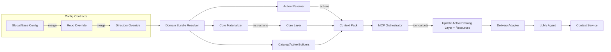

# Context OS Architecture – KODUS

> Blueprint for an agnostic, production-grade context operating system powering any LLM workflow (code review, bugs, support, legal, etc.).

---

## 1. Design Goals
- **Agnostic by default**: domain logic plugged through materializers, selectors, connectors.
- **Layered context**: explicit separation between **Core** (instructions/contracts), **Catalog** (summaries/index), **Active** (on-demand snippets/resources).
- **Composable services**: each capability exposed via interfaces (`ContextLayerBuilder`, `ContextTelemetry`, `ContextPackBuilder`, etc.).
- **Observability & governance first**: lineage, TTL, groundedness, MCP execution logs.
- **Tool-aware**: MCP-first orchestration so packs can declare required tool chains.
- **Cost-aware**: token budgeting, compaction, caching.
- **Safe-by-construction**: confidentiality, redaction, PII handling embedded in contracts.

---

## 2. High-Level Landscape

```mermaid
flowchart TD
    subgraph Offline / Batch
        A[Connectors] --> B[Ingestion Pipelines]
        B --> C[Knowledge Fabric]
        C --> D[Indexers (Vector/BM25/Graph)]
    end

    subgraph Online / Request
        E[Layer Input Builder] --> F[Tri-layer Pack Pipeline]
        F --> G{Pack}
        G --> H[MCP Orchestrator]
        H --> I[Delivery Adapter]
        I --> J[LLM / Runtime Agent]
        J --> K[Context Service (Session)]
        K --> L[Telemetry & Drift]
        L --> F
        G --> L
    end

    C -.-> G
    D -.-> F
```

---

## 3. Core Capabilities

### 3.1 Knowledge Fabric (Unified Memory)
- **Connectors**: pluggable ingest from Git, Jira, Notion, DBs, telemetry.
- **Normalization**: convert raw assets into `KnowledgeItem` with:
  - `domain`, `confidentiality`, `ttlMs`, `metadata.tags`, `lineage`.
  - Payload variants: `text`, `structured`, `attachments`.
- **Validation**: schema, ownership, TTL compliance.
- **Storage** (pluggable): Postgres, document store, object storage links.
- **Lineage tracking**: `LineageRecord` appended on create/update/compact.

### 3.2 Indexing Mesh
- **Vector indices** (FAISS/Weaviate/Chroma) for semantic similarity.
- **Lexical indices** (BM25/Lucene) for keyword precision.
- **Adjacency / Graph view**:
  - Lightweight adjacency JSON (cheap selector).
  - Optional Neo4j/Graphiti for deep relationships.
- **Caches**: recency-based pack cache, Frequent Intentional Compaction (ACE).

### 3.3 Selector Orchestration
- `RetrievalQuery` → orchestrate hybrid selection:
  1. **Pre-filter**: lexical + metadata heuristics (domain, confidentiality).
  2. **Semantic ranking**: embeddings.
  3. **Structural expansion**: adjacency/AST, BugSpec relations.
  4. **Rerank**: cross-encoder, domain heuristics (risk, owner).
- **Selector interfaces**: `ActiveLayerSelector`, `CatalogLayerMaterializer`.
- **Diagnostics**: store scores, reasons, coverage metrics inside `Candidate.metadata`.

### 3.4 Pack Assembly (Runtime)
- `SequentialPackAssemblyPipeline` (already implemented):
  - Steps: Core, Catalog, Active.
  - Each builder enforces budgets, collects diagnostics.
- `TriLayerPackBuilder` wraps pipeline for request-level orchestration.
- **Core Layer**: instructions, persona, policies, tool inventory.
- **Catalog Layer**: structured summaries, entity references, risk map.
- **Active Layer**: prioritized snippets, code diffs, logs, attachments.
- **Budgeting**: `computeBudget(limit, layers)` ensures token discipline.
- **Pack metadata**: task intent, diagnostics, constraints, `requiredActions` (incl. MCP entries in `requiredTools`).

### 3.5 MCP Integration
- `InMemoryMCPRegistry` (or persistent variant) to manage MCP registrations.
- `MCPOrchestrator` executa ações `type = "mcp"` listadas em `pack.requiredTools` antes da entrega:
  - Sanitizes inputs.
  - Handles retries, telemetry, latency tracking.
  - Attaches tool outputs as `ContextResourceRef` or layer snippets.
- **Tool triggers**:
  - `pre_core`: inform materializers with tool availability.
  - `pre_delivery`: ensure outputs exist before LLM gets the pack.
  - Future: `async` hooks for long-running tools.

### 3.6 Delivery & Runtime
- `DeliveryAdapter` transforms pack into system/user/tool messages for target LLM.
- `ContextService` maintains `RuntimeContextSnapshot` (messages, entities, knowledgeRefs).
- **State updates**: after LLM/tool responses, `ContextService.updateSession`.
- **Format adapters**: chat, JSON (bug reviewer), streaming.

### 3.7 Observability & Governance
- `ContextTelemetry` events:
  - `SELECTION`: tokens per layer, selectors used.
  - `DELIVERY`: latency, token usage, LLM metadata.
  - `UPDATE`: session progress, knowledge reuse.
  - `ERROR`: tool/selector failures, drift alerts.
- **Metrics**: groundedness mean/p95, pack reuse rate, ação/MCP success rate.
- **Alerts**: TTL expiry, context rot detection, confidentiality breaches.
- **Audit**: each pack stores `provenance`, source `KnowledgeItem` IDs.

---

## 4. Interface Contracts (Summary)

| Concern | Interface | Responsibility |
| --- | --- | --- |
| Knowledge ingestion | `Connector`, `IngestionPipeline` | Stream assets, normalize, validate |
| Retrieval | `RetrievalQuery`, `RetrievalResult` | Query knowledge fabric for specific task intent |
| Layer build | `ContextLayerBuilder` | Produce layer content respecting budgets/priorities |
| Pack assembly | `PackAssemblyPipeline`, `ContextPackBuilder` | Compose layers + resources |
| Tool orchestration | `MCPRegistry`, `MCPOrchestrator`, `MCPClient` | Register, invoke, track MCP tools |
| Delivery | `DeliveryAdapter` | Format payload + invoke LLM/agent |
| Session state | `RuntimeContextStore` | Persist conversation state, knowledge references |
| Telemetry | `ContextTelemetry` | Record metrics/events, expose reports |

---

## 5. Domain Specialization Pattern

```text
├── domains/
│   ├── code-review/
│   │   ├── core-materializer.ts      // extends DefaultCoreMaterializer
│   │   ├── catalog-materializer.ts   // builds PR/BugSpec summaries
│   │   ├── active-selector.ts        // diffs, AST heuristics
│   │   └── mcp-tools.ts              // required MCP tool descriptors
│   ├── bug-triage/
│   ├── support/
│   └── legal/
└── runtime/
    └── index.ts                      // exports builder factories per domain
```

- Domain packages implement interfaces but reuse core utilities (token estimator, budget, selectors).
- Config layer (outside the OS) maps repo/team overrides to domain bundles.
- Fallback defaults remain available for new domains (minimal configuration).

---

## 6. Flow Narratives

### 6.1 Offline Ingestion
1. Connector detects change (`RawChange`).
2. Ingestion pipeline normalizes to `KnowledgeItem`.
3. Validation adds lineage (`created`), TTL, confidentiality.
4. Persist → update vector/BM25 indices → refresh adjacency caches.
5. Trigger drift detectors (optional) for stale knowledge.

### 6.2 Online Request (e.g., PR Review)
1. `LayerInputBuilder` composes `LayerInputContext`:
   - Domain `code`, intent `review`.
   - Retrieves relevant `KnowledgeItem` via hybrid selector.
   - Pulls runtime session snapshot.
   - Resolves config overrides (persona, severity flags, ações configuradas).
2. `SequentialPackAssemblyPipeline` builds tri-layer pack.
3. Pack registra `requiredActions` e deriva `requiredTools` para ações `type = "mcp"`.
4. `ActionExecutor` (inclui `MCPOrchestrator` para MCPs) executa as ações antes da entrega; outputs são incorporados ao pack.
5. `DeliveryAdapter` sends system/user prompts to LLM; track tokens.
6. Responses/tool calls update `ContextService`; telemetry records `DELIVERY`.

### 6.3 Action Output Reuse
1. Action output saved as new `KnowledgeItem` (`domain: tool_output` ou conforme tipo).
2. Added to catalog for future requests (cache hits reduce tool re-invocation).
3. Telemetry monitors reuse frequency to evaluate ROI.

---

## 7. Governance & Security
- **Confidentiality enforcement**: selectors filter by `metadata.confidentiality` and requestor permissions.
- **Redaction**: `sanitizeMCPInput` scrubs secrets; connectors mask PII at ingestion.
- **TTL policies**: expired knowledge automatically excluded; triggers drift alerts.
- **Access contracts**: domain bundles declaram quais ações/MCPs são permitidos; conectores reforçam escopos de acesso.
- **Audit trails**: `ContextPack.provenance` references knowledge version + tool runs.

---

## 8. Extensibility Roadmap

| Milestone | Description | Outcomes |
| --- | --- | --- |
| M1 – MVP Runtime | Wire defaults (tri-layer, default selectors/materializers, MCP registry, console telemetry) | Run experiments end-to-end |
| M2 – Knowledge Fabric | Persist `KnowledgeItem`, implement hybrid index, ingestion SDK | Domain data ingestion ready |
| M3 – Domain Bundles | Code review & bug triage specializations, tool catalogs | Replace legacy prompts |
| M4 – Observability | Metrics store, dashboards, drift detection, alerting | SLOs for context quality |
| M5 – Governance | Access control, compliance checks, approval workflows | Enterprise readiness |
| M6 – Adaptive Context | Learning-based rerank, ACE compaction, pack caching | Token & latency optimization |

---

## 9. Open Questions / Future Work
- Dynamic pricing of context (token budget vs. business value).
- Cooperative agents: multiple packs composed for team workflows.
- Human-in-loop review UI for pack inspection & override.
- Automated evaluation harness (context rot, groundedness, domain accuracy).
- Knowledge conflict resolution (multiple versions, policy precedence).

---

## 10. References
- `context-engineering/interfaces.ts` – canonical contracts.
- `context-engineering/pipeline/*` – pack assembly runtime.
- `context-engineering/materializers/*` – default implementations.
- `context-engineering/mcp/*` – MCP registry/orchestrator utilities.
- Docs: `tri-layer-flow.md`, `bug-context-architecture.md`, `selector-low-cost.md`, `cheap-strategies.md`.

---

## 11. Meta Prompt + MCP Wiring (Example)



### Step-by-step
1. **Configurations & Meta Prompt**
   - Global → repo → diretório overrides produzem um **Config Snapshot** (meta prompt, severities, políticas, ferramentas).
   - O **Domain Bundle Resolver** escolhe materializers/selectors especialistas (ex.: `domains/code-review/*`).
2. **Core Materializer**
   - Converte meta prompt em `CoreLayerMaterial`: persona, instruções, checagens, idioma.
   - Anexa notas sobre ferramentas disponíveis/obrigatórias.
3. **Action Resolver**
   - Converte overrides em `ContextActionDescriptor` (tipo, trigger, config).
   - Para ações `type = "mcp"`, registra também como `ContextPack.requiredTools` para reutilizar o `MCPOrchestrator`.
   - Injeta instruções no core layer explicando quais ações foram registradas.
4. **Pack Assembly**
   - `SequentialPackAssemblyPipeline` monta o pack tri-layer com instruções + catálogo + snippets.
5. **MCP Execution**
   - `MCPOrchestrator` roda cada ferramenta obrigatória antes da entrega.
   - Saídas viram `ContextResourceRef` ou snippets adicionais no active/catalog layer.
6. **Delivery & Runtime**
   - `DeliveryAdapter` monta prompt final (system/user/tool) com base no pack enriquecido.
   - `ContextService` registra resposta/tool calls; telemetria loga eventos.

### Contracts Involved
- `CodeReviewConfig` (ou config genérica) → `Config Snapshot`.
- `DomainBundle` (custom helper) → produz `CoreLayerMaterializer`, `CatalogMaterializer`, `ActiveSelector`, `ContextActionDescriptor[]`.
- `ContextPack.requiredTools` / `ContextPack.requiredActions` → alimentam executores.
- `ContextTelemetry` acompanha tempos de execução, falhas e outputs das ações.

---

## 12. Domain Bundle Module

Arquitetamos um módulo para traduzir qualquer configuração (meta prompt, políticas, ferramentas) em componentes concretos da pipeline. A ideia é manter o **runtime agnóstico**, enquanto cada domínio (code, bug, suporte) fornece sua “caixa de ferramentas”.

### 12.1 Estrutura sugerida
```
context-engineering/
  domains/
    index.ts              // Registry/lookup
    code-review/
      bundle.ts           // factory principal
      core-materializer.ts
      catalog-materializer.ts
      active-selector.ts
      actions.ts          // action descriptors (MCP, workflows etc.)
    bug-triage/
      ...
```

### 12.2 Contrato DomainBundle
```ts
// domains/types.ts
export interface DomainBundleContext {
  domain: string;
  taskIntent: string;
  configSnapshot: ConfigSnapshot; // merge global/repo/diretório/meta prompt
  knowledge: {
    retrieval: RetrievalResult;
    services: KnowledgeServices; // wrappers para indices, bug spec store etc.
  };
  runtime?: RuntimeContextSnapshot;
}

export interface DomainBundle {
  id: string;
  supports(context: DomainBundleContext): boolean;
  createCoreMaterializer(context: DomainBundleContext): CoreLayerMaterializer;
  createCatalogMaterializer(context: DomainBundleContext): CatalogLayerMaterializer;
  createActiveSelector(context: DomainBundleContext): ActiveLayerSelector;
  resolveActions?(context: DomainBundleContext): ContextActionDescriptor[];
  metadata?: Record<string, unknown>;
}
```

### 12.3 Resolvedor de bundles
```ts
// domains/index.ts
const bundles: DomainBundle[] = [
  createCodeReviewBundle(),
  createBugTriageBundle(),
  createSupportBundle(),
  createFallbackBundle(),
];

export function resolveBundle(input: DomainBundleContext): DomainBundle {
  const bundle =
    bundles.find(b => b.supports(input)) ?? bundles.find(b => b.id === 'fallback');
  return bundle!;
}
```

### 12.4 Integração no runtime
1. Recolhemos `configSnapshot` (global → repo → diretório) + `RetrievalResult`.
2. `resolveBundle` seleciona o domínio adequado.
3. Pipeline tri-layer usa os factories retornados pelo bundle:
   ```ts
   const bundle = resolveBundle(context);
   const core = new CoreLayerBuilder({ materializer: bundle.createCoreMaterializer(context) });
   const catalog = new CatalogLayerBuilder({ materializer: bundle.createCatalogMaterializer(context) });
   const active = new ActiveLayerBuilder({ selector: bundle.createActiveSelector(context) });
   const pipeline = new SequentialPackAssemblyPipeline({ steps: [...] });
   const pack = await pipeline.execute(layerInput, options);
   const actions = bundle.resolveActions?.(context) ?? [];
   pack.requiredActions = actions;
   pack.requiredTools = actions
     .filter(action => action.type === 'mcp')
     .map(action => ({
       mcpId: action.mcpId!,
       toolName: action.toolName!,
       description: action.instruction,
       metadata: action.metadata,
     }));
   ```
4. `ActionExecutor` coordena a execução conforme `trigger` (inclui MCP via `pack.requiredTools`).

### 12.5 Config Snapshot
Para deixar agnóstico, usamos um snapshot estruturado (JSON) que o bundle interpreta:
```ts
interface ConfigSnapshot {
  persona?: AgentIdentity;
  metaPrompt?: string;
  language?: string;
  severityFlags?: Record<string, string>;
  categories?: Record<
    string,
    {
      description?: string;
      actions?: ContextActionDescriptor[];
    }
  >;
  policies?: string[];
  extras?: Record<string, unknown>;
}
```
- O snapshot não depende do formato do prompt atual (pode vir do YAML existente, de UI ou API).
- Cada bundle pega só o que importa (ex.: `code-review` lê `categories.bug.actions` e registra actions + instruções correspondentes).

### 12.6 Vantagens
- **Isolamento**: nenhuma lógica de domínio fica em `core/*` ou `pipeline/*`.
- **Composição**: dá para plugar novos domínios sem tocar no runtime.
- **Testabilidade**: cada bundle pode ter testes unitários com snapshots simulando configs reais.
- **Observabilidade**: bundles escrevem `metadata` no pack (ex.: `builder: 'code-review-bundle', version: '2025.01'`).
- **Consistência**: o core layer recebe instruções explícitas sobre ações registradas (checklists, workflows, MCPs).

---

## 13. Context Actions (MCP, Workflows, Funções Internas)

Para suportar MCPs **e** qualquer outro tipo de automação, tratamos tudo como *actions*.

### 13.1 Estrutura no snapshot
```jsonc
{
  "contextPresets": {
    "code": {
      "review": {
        "categories": {
          "bug": {
            "description": "…meta prompt…",
            "actions": [
              {
                "id": "bug-checklist",
                "type": "mcp",
                "mcpId": "mcp-bug-tools",
                "toolName": "bug-checklist",
                "trigger": "pre_delivery",
                "instruction": "Rodar antes de responder"
              },
              {
                "id": "simulate-bug",
                "type": "workflow",
                "workflowId": "simulate-bug",
                "trigger": "pre_delivery",
                "config": { "depth": 3 }
              },
              {
                "id": "internal-kpi",
                "type": "internal",
                "callable": "bugModule.generateKPIs",
                "trigger": "post_delivery"
              }
            ]
          }
        }
      }
    }
  }
}
```
- Arrays herdam por concatenação/deduplicação (por `id`), preservando overrides global → repo → diretório.
- `type` determina o executor: `mcp`, `workflow`, `internal`, `http`, `lambda`, etc.

### 13.2 Fluxo
```mermaid
flowchart TD
    S[Config Snapshot] --> R[Resolve Bundle]
    R --> A[Bundle resolveActions()]
    A --> P{Context Pack}
    P -->|pre_delivery| X[Action Executor]
    X -->|type=mcp| M[MCP Orchestrator]
    X -->|type=workflow| W[Workflow Engine]
    X -->|type=internal| I[Internal Service]
    M --> O[Action Output]
    W --> O
    I --> O
    O --> L[Layer/Resource Update]
    L --> D[Delivery Adapter → LLM]
    D --> C[Context Service]
    C --> T[Context Telemetry]
```

1. Snapshot fornece `actions`; `resolveBundle` escolhe o domínio.
2. Bundle expõe `resolveActions` e devolve `ContextActionDescriptor[]`.
3. Pack popula `pack.requiredActions` com todas as ações e, para cada `type = "mcp"`, replica a entrada em `pack.requiredTools` para compatibilidade com o `MCPOrchestrator`.
4. `Action Executor` processa conforme `trigger` (`pre_core`, `pre_delivery`, `post_delivery`).
5. Cada executor devolve `ActionExecutionResult` com `success`, `resources`, `layerPatches`.
6. Pack é enriquecido com outputs antes da entrega; telemetria registra tempos e status.

### 13.3 Contratos sugeridos
```ts
export type ContextActionType = 'mcp' | 'workflow' | 'internal' | 'http' | string;

export interface ContextActionDescriptor {
  id: string;
  type: ContextActionType;
  trigger: 'pre_core' | 'pre_delivery' | 'post_delivery';
  instruction?: string;
  metadata?: Record<string, unknown>;
  config?: Record<string, unknown>;
  mcpId?: string;
  toolName?: string;
  workflowId?: string;
  callable?: string;
  endpoint?: string;
}

export interface ActionExecutor {
  supports(action: ContextActionDescriptor): boolean;
  execute(params: {
    action: ContextActionDescriptor;
    pack: ContextPack;
    context: LayerInputContext;
    runtime?: RuntimeContextSnapshot;
  }): Promise<ActionExecutionResult>;
}

export interface ActionExecutionResult {
  success: boolean;
  output?: unknown;
  resources?: ContextResourceRef[];
  layerPatches?: Partial<Record<ContextLayerKind, unknown>>;
  telemetry?: Record<string, unknown>;
}
```

### 13.4 Observabilidade
- `ContextTelemetry` ganha eventos como `ACTION_STARTED`, `ACTION_COMPLETED`, `ACTION_FAILED`.
- Métricas: latência média por tipo, taxa de erro, reaproveitamento de outputs.
- Auditoria: guardar `metadata.sourceLevel` (global/repo/diretório) em cada action.

---

This document serves as the north star for evolving KODUS Context OS. Each section maps directly to modules and experiments already scaffolded in the repository, enabling incremental implementation without locking to a single domain or provider.
