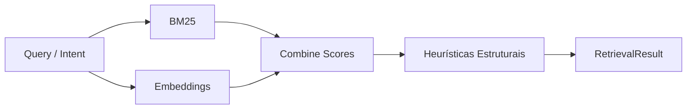

# Plano de Implementação – Selector Híbrido de Baixo Custo

## Objetivo
Melhorar o recall e a contextualização sem custos elevados (sem GraphRAG). A ideia é combinar lexical + embedding + heurísticas estruturais (especialmente para código) e entregar um `RetrievalResult` enriquecido ao pack tri-layer.

---

## 1. Inputs necessários
- **Corpus indexado:**
  - Textos (docs, specs, políticas). Indexamos via embeddings (FAISS/Weaviate) e BM25 (Lucene/Elastic ou mesmo `whoosh`).
  - Artefatos de código (arquivos, diffs) com metadados (path, linguagem, módulo).
- **Estrutura leve:**
  - Para código: extração de AST e call graph básico usando tool (tree-sitter, static analysis). Gera adjacency simples (quem chama quem, imports).
  - Para docs: tags/metadados (owners, módulos, topics) extraídos via TF-IDF/K-means ou manual.

---

## 2. Pipeline de seleção

### 2.1 Passos
1. **Pré-filtro lexical (BM25)**: recuperar top-K (ex.: 30) documentos/chunks mais relevantes.
2. **Embeddings**: rodar busca vetorial sobre chunks mais prováveis; combinar scores com BM25 (ex.: ponderação 0.6 embeddings / 0.4 BM25).
3. **Heurísticas estruturais:**
   - Se é code review, priorizar arquivos na diff, funções chamadas pela alteração, módulos marcados como “criticos”.
   - Usar adjacency lists (ex.: JSON) para expandir dependências diretas (1 hop) sem LLM.
   - Incluir notas (ex.: `metadata`: { "reason": "depends_on", "source": "adjacency" }).
4. **Compaction**: dedup, ordenar por score final, montar `Candidate` com `slices` e `metadata` justificando seleção.

---

## 3. Integração com o tri-layer
- `Core layer`: nada muda (apenas referenciar que selector híbrido está ativo).
- `Catalog layer`: incluir resumo das dependências (ex.: “Arquivo A depende de B; owner: team Y”).
- `Active layer`: trazer diffs/snippets dos arquivos priorizados e logs de heurísticas (por que foram selecionados).
- `ContextResourceRef`: apontar para adjacency JSON ou scripts AST caso modelo precise de detalhes.

---

## 4. Métricas a coletar
- **Coverage/F1**: percentual de respostas onde itens relevantes estão presentes (comparar com baseline vetorial).
- **Tokens usados**: medir se heurísticas aumentam pouco o custo.
- **Tempo de retrieval**: garantir latência baixa (sem Neo4j).
- **Groundedness**: avaliar se heurísticas ajudam a citar fontes corretas.

---

## 5. Experimentos sugeridos
- Dataset code review: criar gabaritos (arquivos que deveriam ser citados). Comparar baseline vs. selector híbrido.
- Dataset documentação: perguntas multi-hop ("quem aprova mudança X?", "qual módulo depende de Y?").
- Ajustar pesos BM25/embeddings/heurísticas e medir sensibilidade.
- Incorporar feedback humano (se modelo citou arquivo errado, ajustar heurística).

---

## 6. Possíveis extensões
- Cache de resultados por PR (reuse pack entre revisões). 
- Aprendizado leve: ajustar pesos de heurísticas com base em histórico de sucesso/falha.
- Suporte a outros domínios (transformar heurísticas para workflows de suporte, finanças). 
