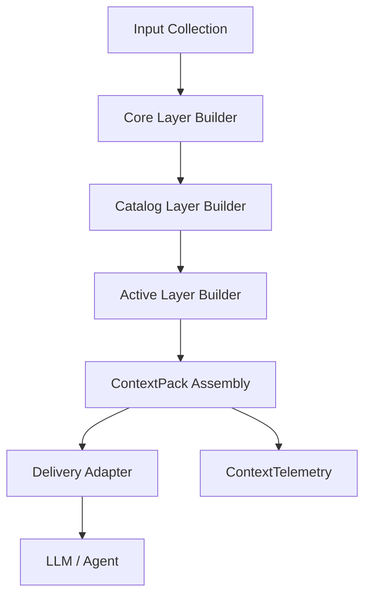

# Fluxo Tri-Layer – Context OS (Code Review)

Este documento descreve o fluxo operacional do pack tri-layer para o experimento 1 (code review). Cada etapa lista entradas, processamento e saídas esperadas.

## 0. Coleta de Entradas
- **Fontes:**
  - Metadados do PR (autor, título, arquivos tocados, labels).
  - Políticas/Guidelines da equipe (linters, testes obrigatórios, convenções).
  - Histórico relevante (últimos feedbacks do mesmo PR, notas anteriores).
  - Artefatos reusáveis (checklists, templates de review, scripts de teste).
- **Objetivo:** Normalizar tudo em `KnowledgeItem` + `LayerInputContext`.
- **Saída:** `LayerInputContext` com `retrieval` básico (lista de arquivos/diffs) e contexto de runtime (se já existir sessão).

## 1. Core Layer Builder
- **Entradas:**
  - `LayerInputContext` (domínio = `code`, intent = `review`).
  - Políticas globais, persona do reviewer, objetivos do processo.
- **Processamento:**
  - Produz instruções residentes (linguagem, tom, checklist mínimo).
  - Define ferramentas autorizadas (ex.: `run_tests`, `list_files`).
  - Registra constraints (citar arquivos, sugerir testes, etc.).
- **Saída:**
  - `ContextLayer` com `kind = core`, `residence = resident` (geralmente < 1k tokens).
  - Pode anexar recursos (ex.: manifesto de políticas) via `ContextResourceRef`.

## 2. Catalog Layer Builder
- **Entradas:**
  - `LayerInputContext` + resultado do core.
  - Metadados do PR e sumários iniciais (arquivos, módulos afetados, owners).
  - Histórico condensado (últimos comentários, status pipeline CI).
- **Processamento:**
  - Gera resumo estruturado (`progress.md`, spec ou plan) em formato compacto.
  - Mantém budget alvo (~1–2k tokens) com agregação (map-reduce, dedupe).
  - Marca arquivos prioritários / risco alto.
- **Saída:**
  - `ContextLayer` com `kind = catalog`, `residence = resident`.
  - Referências a entidades (arquivos, owners) para facilitar navegação.

## 3. Active Layer Builder
- **Entradas:**
  - `LayerInputContext` com diffs/snippets selecionados.
  - Lista de arquivos relevantes (do catalog) e consultas on-demand.
  - Ferramentas (ex.: AST lookup, test logs).
- **Processamento:**
  - Recupera diffs com granularidade controlada (ex.: top N blocos por heurística).
  - Quando necessário, carrega conteúdos extensos via `ContextResourceRef` (para execução posterior, não carregado em tokens).
  - Atualiza `LayerBuildDiagnostics` (tokens before/after, compaction usada).
- **Saída:**
  - `ContextLayer` com `kind = active`, `residence = on_demand` (carregado por evento, max tokens ~3k).
  - Lista de `resources` para acesso a scripts, logs, testes.

## 4. ContextPack Assembly
- **Entradas:**
  - Resultado das três camadas (core/catalog/active) + recursos associados.
  - Diagnósticos (tokens, estratégias usadas).
- **Processamento:**
  - Monta `ContextPack` (id, versão, metadata) e consolida budget (limite vs uso).
  - Registra provenance/lineage para auditoria (ex.: de quais `KnowledgeItem` veio cada trecho).
- **Saída:**
  - `ContextPack` completo (tri-layer) + `resources`.
  - `ContextTelemetry` recebe evento `SELECTION` com tokens/camada, budget etc.

## 5. Delivery / LLM
- **Entradas:**
  - `ContextPack` + `RuntimeContextSnapshot` (sessão atual).
  - `DeliveryRequest` (identidade do agente, formato de saída).
- **Processamento:**
  - `DeliveryAdapter` monta mensagens (system/user/tool) e injeta tool schemas.
  - Encaminha para LLM / agente executor.
  - Resultados (respostas, tool calls) alimentam `ContextService` (mensagens, estado, entidades).
- **Saída:**
  - Resposta do agente, logs de execução, atualizações de sessão.
  - Telemetria `DELIVERY`/`UPDATE` para métricas históricas.

## Observabilidade e Feedback
- **ContextTelemetry:** registra tokens por camada, groundedness, reuse, alertas (rot). Relatórios alimentam experimentos.
- **Feedback Humano:** reviewers validam decisões, anotam erros, alimentando heurísticas futuras (ex.: ajuste no catalog builder).

---

### Considerações Técnicas
- `ContextLayerBuilder` e `PackAssemblyPipeline` (ver `interfaces.ts`) formalizam as etapas.
- Conectores/normalizadores devem produzir `KnowledgeItem` com metadados (domínio, confidencialidade, TTL).
- Compactação pode usar resumos multi-passo (map-reduce, top-k embeddings) e heurísticas (ACE) para manter orçamento.
- `ContextResourceRef` garante acesso a arquivos pesados sem inflar tokens.
